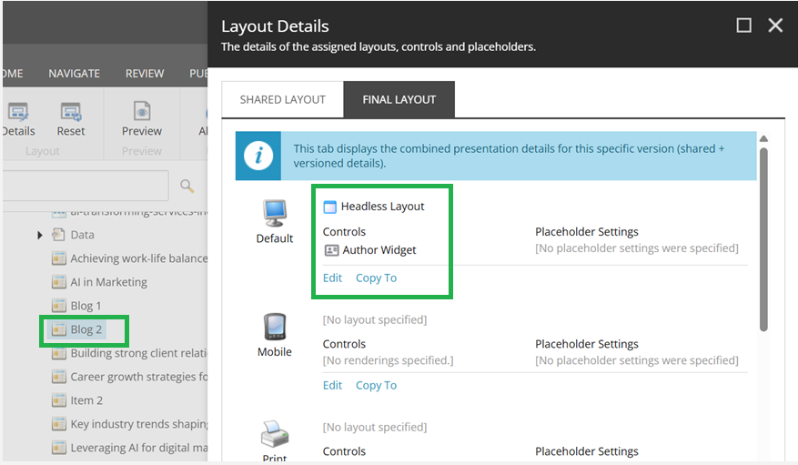
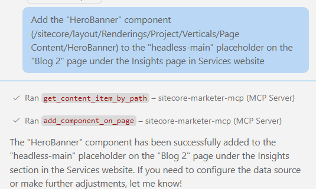
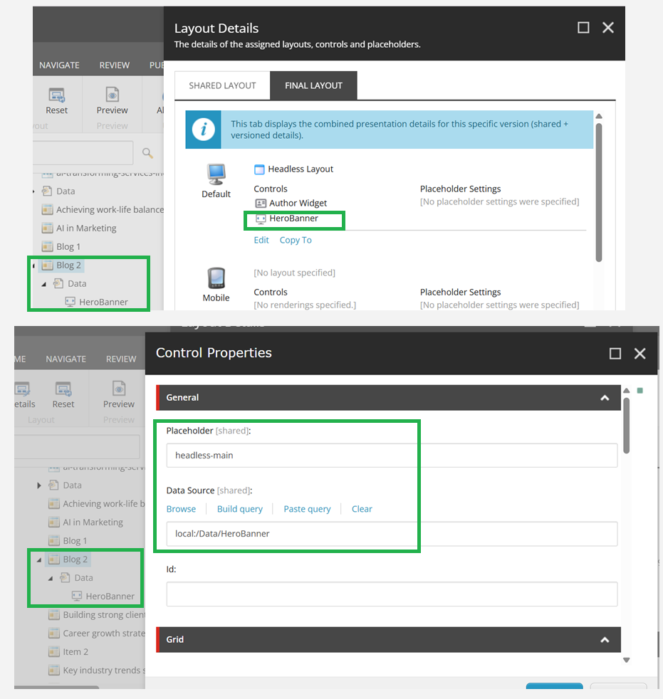

# Add Component to Page

## Prompt:
Add the "HeroBanner" component (/sitecore/layout/Renderings/Project/Verticals/Page Content/HeroBanner) to the "headless-main" placeholder on the "Blog 2" page under the Insights page in Services website

## Description:
This prompt adds a component to a specified placeholder on a given page.

## Before Update:
Page details before adding the component or rendering.




<br/><br/>

# Optimizing Tool Selection for Page Update

This guide demonstrates the actual tool execution order and payloads used to add the component to the page.


## Tool Execution Order and Payloads


### 1. Get Content Item by Path (to get the Insights section)
**Tool:** `mcp_sitecore-mark_get_content_item_by_path`

```json
{
  "itemPath": "/sitecore/layout/Renderings/Project/Verticals/Page Content/HeroBanner",
  "language": "en"
}
```

**Output:**

```json
{
  "itemId": "2278bb40-e848-4032-af3c-181d94edae7b",
  "name": "HeroBanner",
  "path": "/sitecore/layout/Renderings/Project/Verticals/Page Content/HeroBanner",
  "workflow": null,
  "children": null,
  "version": null,
  "template": {
    "templateId": "04646a89-996f-4ee7-878a-ffdbf1f0ef0d",
    "name": "Json Rendering"
  },
  "fields": {
    "componentName": "HeroBanner",
    "Data source": "",
    "Parameters": "",
    "Placeholder": "",
    "Customize Page": "",
    "Description": "",
    "Open Properties after Add": "0",
    "Parameters Template": "{04774333-8499-4bb5-9530-763cbcf90dec}",
    "AddFieldEditorButton": "1",
    "FieldEditorFields": "",
    "ComponentQuery": ""
  },
  "created_at": null,
  "updated_at": null
}
```

### 2. Add Component on Page
**Tool:** `mcp_sitecore-mark_add_component_on_page`
```json
{
  "componentItemName": "HeroBanner",
  "componentRenderingId": "2278bb40-e848-4032-af3c-181d94edae7b",
  "language": "en",
  "pageId": "c8297630-08ec-478d-8f45-444c71c5a6d1",
  "placeholderPath": "headless-main"
}
```

**Output:**

```json
{
  "componentId": "2278bb40-e848-4032-af3c-181d94edae7b",
  "pageId": "c8297630-08ec-478d-8f45-444c71c5a6d1",
  "placeholderId": "headless-main",
  "datasourceId": "8bcac330-0908-495a-8218-4af2d28450d2"
}
```

## After Update:
Page details after adding the component or rendering.


---

Use this step-by-step tool execution and payload reference to automate or document the site related actions.

