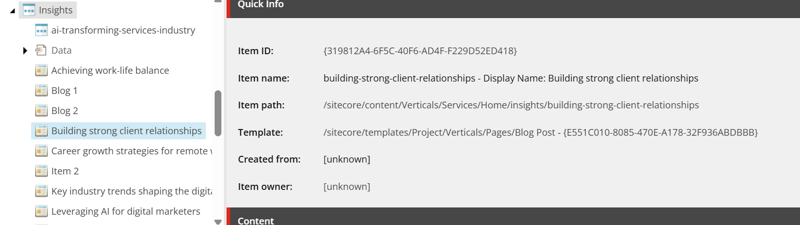
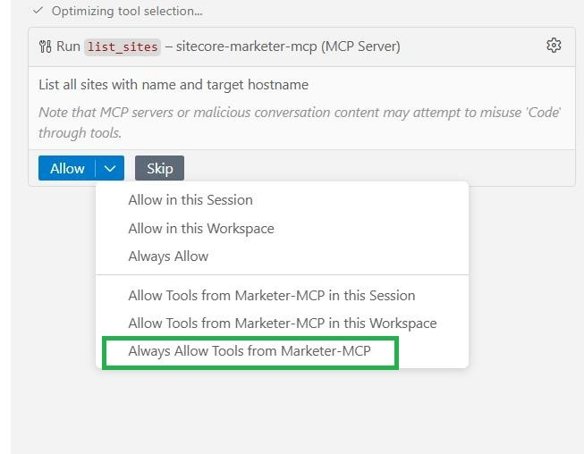
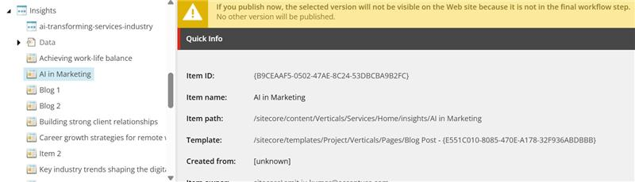

# Create Content Item

## Prompt:
Create a new blog post titled "AI in Marketing" using the BlogPost template under the Insights in Services website.

## Description:
This prompt creates a new content item in Sitecore using the specified template and title.

## Before Update:
Content tree state prior to adding the new blog post.




<br/><br/>

# Optimizing Tool Selection for Blog Post Creation

This guide demonstrates the actual tool execution order and payloads used to create a new blog post titled "AI in Marketing" under Insights in the Services website, using the BlogPost template.


## Tool Execution Order and Payloads



### 1. List All Sites (to find the Services site)
**Tool:** `mcp_sitecore-mark_list_sites`

**Output:**
```json
{
  "sites": [
    {
      "id": "6417d40a-cc79-473a-86d5-dd519e2edc6b",
      "name": "Basic",
      "targetHostname": "",
      "rootPath": "12063311-03e1-41f8-b14d-2e9e3780dbbb"
    },
    {
      "id": "a6f7b836-cfa3-4c6b-9533-1e9d2cec796c",
      "name": "Services",
      "targetHostname": "",
      "rootPath": "778c7495-483f-4eb3-b540-a5288fc48d48"
    },
  ]
}
```

### 2. Get Content Item by ID (to get the Home node of Services)
**Tool:** `mcp_sitecore-mark_get_content_item_by_id`
> Get the path of Home Item from Services Website
```json
{
  "itemId": "d6a99160-055f-490e-b6de-f2ba79913b74"
}
```
**Output:**
```json
{
  "itemId": "d6a99160-055f-490e-b6de-f2ba79913b74",
  "name": "Home",
  "path": "/sitecore/content/Verticals/Services/Home",
  "workflow": {
    "workflowState": {
      "final": true,
      "displayName": "Approved"
    }
  },
  "children": null,
  "version": 1,
  "template": {
    "templateId": "2fbabaaf-08af-4720-a598-74d131b29577",
    "name": "Full Width Page"
  },
  "fields": {
    "Content": "We're thrilled to have you here. Whether you're exploring our services, seeking information, or just browsing, we hope you find everything you need. If you have any questions or need assistance, don't hesitate to reach out. Enjoy your visit! - 2",
    "Title": "PLAY! Services"
  },
  "created_at": null,
  "updated_at": null
}
```

### 3. Get Content Item by Path (to get the Insights section)
**Tool:** `mcp_sitecore-mark_get_content_item_by_path`
> Get the Item Id of Insights Item under Parent Home Item
```json
{
  "itemPath": "/sitecore/content/Verticals/Services/Home/Insights"
}
```

**Output:**

```json
{
  "itemId": "7bdd77da-db8d-4c3e-b3af-fb7fe9e544ab",
  "name": "insights",
  "path": "/sitecore/content/Verticals/Services/Home/insights",
  "workflow": null,
  "children": null,
  "version": null,
  "template": {
    "templateId": "ebcf67f8-175a-4b61-9d45-b2c9591b69f3",
    "name": "Content Page"
  },
  "fields": {
    "BackgroundImage": "",
    "Content": "",
    "Title": "Insights"
  },
  "created_at": null,
  "updated_at": null
}
```

### 4. List Available Insert Options (to find BlogPost template)
**Tool:** `mcp_sitecore-mark_list_available_insertoptions`

```json
{
  "itemId": "7bdd77da-db8d-4c3e-b3af-fb7fe9e544ab"
}
```

**Output:**
```json
[
  {
    "name": "Blog Post",
    "templateId": "fe9cb80d-98f9-4f16-bd18-bbde80376859"
  }
]
```

### 5. Create Blog Post
**Tool:** `mcp_sitecore-mark_create_content_item`
```json
{
  "name": "AI in Marketing",
  "parentId": "7bdd77da-db8d-4c3e-b3af-fb7fe9e544ab",
  "templateId": "fe9cb80d-98f9-4f16-bd18-bbde80376859"
}
```

**Output:**
```json
{
  "itemId": "772ebdbb-b809-448e-bb61-c2770451c441",
  "name": "AI in Marketing",
  "path": "/sitecore/content/Verticals/Services/Home/insights/AI in Marketing",
  "templateId": "fe9cb80d-98f9-4f16-bd18-bbde80376859",
  "version": 1
}
```

### 6. (Optional) Get Content Item by ID (to get the new Blog Post's itemId)
**Tool:** `mcp_sitecore-mark_get_content_item_by_id`
```json
{
  "itemId": "772ebdbb-b809-448e-bb61-c2770451c441"
}
```

**Output:**
```json
{
  "itemId": "772ebdbb-b809-448e-bb61-c2770451c441",
  "name": "AI in Marketing",
  "path": "/sitecore/content/Verticals/Services/Home/insights/AI in Marketing",
  "workflow": {
    "workflowState": {
      "final": false,
      "displayName": "Draft"
    }
  },
  "children": null,
  "version": 1,
  "template": {
    "templateId": "fe9cb80d-98f9-4f16-bd18-bbde80376859",
    "name": "Blog Post"
  },
  "fields": {
    "BackgroundImage": "",
    "Content": "<p><strong>Lorem Ipsum Finance</strong></p>\r\n<p>\r\nLorem ipsum dolor sit amet, consectetur adipiscing elit. Sed ullamcorper neque id elit convallis, at varius lorem aliquet. Phasellus consequat, ante sed tristique commodo, felis mi vehicula justo, id finibus neque velit vitae nunc.</p>\r\n<p>Vestibulum ante ipsum primis in faucibus orci luctus et ultrices posuere cubilia curae; Proin at mauris vel purus vestibulum consectetur. Nam efficitur lectus auctor, hendrerit ligula nec, pharetra ex.</p>\r\n<p>Suspendisse potenti. Sed ac arcu scelerisque, hendrerit risus eu, ultricies libero. Pellentesque ut magna eu elit fringilla viverra. Quisque ullamcorper orci a magna finibus, nec feugiat urna semper. Praesent blandit purus vel ligula finibus, nec fermentum dui ultrices. Nulla vitae justo a felis luctus dignissim. Aliquam eu tortor eget libero placerat semper.</p>\r\n<p>In consequat, libero sed viverra placerat, metus lectus accumsan velit, a suscipit elit dui sit amet justo. Fusce vitae purus vel justo aliquam hendrerit. Integer pretium mi vel ex convallis, vel dignissim ex finibus.</p>",
    "Excerpt": "Maintaining a healthy work-life balance is crucial for employee satisfaction and productivity. Explore practical strategies that employees can implement to support their team’s well-being and create a more balanced, productive work environment.",
    "Thumbnail": "<image mediaid=\"{32909CAB-5F82-4428-A428-DF531E7776DD}\" alt=\"Market report\" height=\"\" width=\"\" hspace=\"\" vspace=\"\" />",
    "Title": "AI in Marketing"
  },
  "created_at": null,
  "updated_at": null
}
```

## After Update:
Content tree state after adding the new blog post.



---

Use this step-by-step tool execution and payload reference to automate or document the blog post creation process using Sitecore MCP tools.

