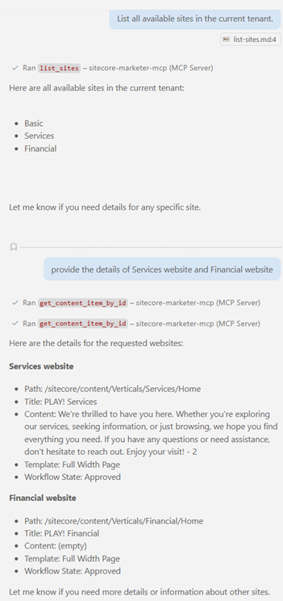

# List All Sites

## Prompt:
List all available sites in the current tenant.


## Description:
This prompt retrieves a list of all sites configured in the Sitecore environment.

<br/>

# Optimizing Tool Selection for Blog Post Update

This guide demonstrates the actual tool execution order and payloads used to get the list of websites in the current tenant.


## Tool Execution Order and Payloads


### 1. Get Content Item by Path (to get the Blog 2 node)
**Tool:** `mcp_sitecore-mark_list_sites`
```json
{}
```

**Output:**

```json
{
  "sites": [
    {
      "id": "6417d40a-cc79-473a-86d5-dd519e2edc6b",
      "name": "Basic",
      "targetHostname": "",
      "rootPath": "12063311-03e1-41f8-b14d-2e9e3780dbbb"
    },
    {
      "id": "a6f7b836-cfa3-4c6b-9533-1e9d2cec796c",
      "name": "Services",
      "targetHostname": "",
      "rootPath": "778c7495-483f-4eb3-b540-a5288fc48d48"
    },
    {
      "id": "2a30c48a-4636-4e69-a977-3587dde4fa9e",
      "name": "Financial",
      "targetHostname": "",
      "rootPath": "f471bc91-402d-40d2-85c1-f80fc6fd6948"
    },     
  ]
}
```
### 2. Get Site Details
**Tool:** `mcp_sitecore-mark_get_content_item_by_id`
```json
{
  "itemId": "a6f7b836-cfa3-4c6b-9533-1e9d2cec796c",
  "language": "en"
}
```

**Output:**
```json
{
  "itemId": "a6f7b836-cfa3-4c6b-9533-1e9d2cec796c",
  "name": "Home",
  "path": "/sitecore/content/Verticals/Services/Home",
  "workflow": {
    "workflowState": {
      "final": true,
      "displayName": "Approved"
    }
  },
  "children": null,
  "version": 1,
  "template": {
    "templateId": "d8729844-df8b-44e2-bae3-369d2e444aea",
    "name": "Full Width Page"
  },
  "fields": {
    "Content": "We're thrilled to have you here. Whether you're exploring our services, seeking information, or just browsing, we hope you find everything you need. If you have any questions or need assistance, don't hesitate to reach out. Enjoy your visit! - 2",
    "Title": "PLAY! Services"
  },
  "created_at": null,
  "updated_at": null
}
```

---

Use this step-by-step tool execution and payload reference to automate or document the site related actions.

