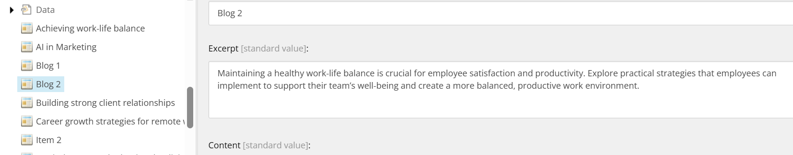
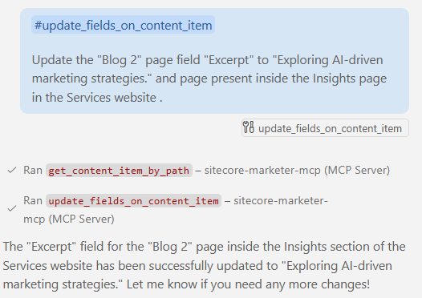
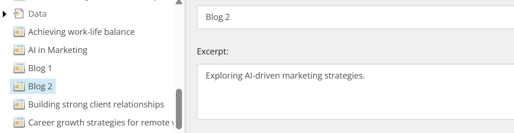

# Update Content Item

## Prompt:
#update_fields_on_content_item 

Update the "Blog 2" page field "Excerpt" to "Exploring AI-driven marketing strategies." and page present inside the Insights page in the Services website .

## Description:
This prompt updates a specific field of an existing content item.

## Before Update:
Content tree state prior to update the new blog post.




<br/><br/>

# Optimizing Tool Selection for Blog Post Update

This guide demonstrates the actual tool execution order and payloads used to update a blog post titled "Blog 2" under Insights in the Services website.


## Tool Execution Order and Payloads


### 1. Get Content Item by Path (to get the Blog 2 node)
**Tool:** `mcp_sitecore-mark_get_content_item_by_path`
> Get the Item Id of Blog 2 Item
```json
{
  "itemPath": "/sitecore/content/Verticals/Services/Home/insights/Blog 2",
  "language": "en"
}
```

**Output:**

```json
{
  "itemId": "c23dea08-3d20-4a67-beeb-3221b00e162c",
  "name": "Blog 2",
  "path": "/sitecore/content/Verticals/Services/Home/insights/Blog 2",
  "workflow": null,
  "children": null,
  "version": null,
  "template": {
    "templateId": "fe9cb80d-98f9-4f16-bd18-bbde80376859",
    "name": "Blog Post"
  },
  "fields": {
    "BackgroundImage": "",
    "Content": "<p><strong>Lorem Ipsum Finance</strong></p>\r\n<p>\r\nLorem ipsum dolor sit amet, consectetur adipiscing elit. Sed ullamcorper neque id elit convallis, at varius lorem aliquet. Phasellus consequat, ante sed tristique commodo, felis mi vehicula justo, id finibus neque velit vitae nunc.</p>\r\n<p>Vestibulum ante ipsum primis in faucibus orci luctus et ultrices posuere cubilia curae; Proin at mauris vel purus vestibulum consectetur. Nam efficitur lectus auctor, hendrerit ligula nec, pharetra ex.</p>\r\n<p>Suspendisse potenti. Sed ac arcu scelerisque, hendrerit risus eu, ultricies libero. Pellentesque ut magna eu elit fringilla viverra. Quisque ullamcorper orci a magna finibus, nec feugiat urna semper. Praesent blandit purus vel ligula finibus, nec fermentum dui ultrices. Nulla vitae justo a felis luctus dignissim. Aliquam eu tortor eget libero placerat semper.</p>\r\n<p>In consequat, libero sed viverra placerat, metus lectus accumsan velit, a suscipit elit dui sit amet justo. Fusce vitae purus vel justo aliquam hendrerit. Integer pretium mi vel ex convallis, vel dignissim ex finibus.</p>",
    "Excerpt": "Maintaining a healthy work-life balance is crucial for employee satisfaction and productivity. Explore practical strategies that employees can implement to support their team’s well-being and create a more balanced, productive work environment.",
    "Thumbnail": "<image mediaid=\"{32909CAB-5F82-4428-A428-DF531E7776DD}\" alt=\"Market report\" height=\"\" width=\"\" hspace=\"\" vspace=\"\" />",
    "Title": "Blog 2"
  },
  "created_at": null,
  "updated_at": null
}
```
### 2. Update Blog Post
**Tool:** `mcp_sitecore-mark_update_fields_on_content_item`
```json
{
  "itemId": "c23dea08-3d20-4a67-beeb-3221b00e162c",
  "fields": {
    "Excerpt": "Exploring AI-driven marketing strategies."
  }
}
```

**Output:**
```json
{
  "itemId": "c23dea08-3d20-4a67-beeb-3221b00e162c",
  "name": "Blog 2",
  "path": "/sitecore/content/Verticals/Services/Home/insights/Blog 2",
  "updatedFields": {
    "BackgroundImage": "",
    "Content": "<p><strong>Lorem Ipsum Finance</strong></p>\r\n<p>\r\nLorem ipsum dolor sit amet, consectetur adipiscing elit. Sed ullamcorper neque id elit convallis, at varius lorem aliquet. Phasellus consequat, ante sed tristique commodo, felis mi vehicula justo, id finibus neque velit vitae nunc.</p>\r\n<p>Vestibulum ante ipsum primis in faucibus orci luctus et ultrices posuere cubilia curae; Proin at mauris vel purus vestibulum consectetur. Nam efficitur lectus auctor, hendrerit ligula nec, pharetra ex.</p>\r\n<p>Suspendisse potenti. Sed ac arcu scelerisque, hendrerit risus eu, ultricies libero. Pellentesque ut magna eu elit fringilla viverra. Quisque ullamcorper orci a magna finibus, nec feugiat urna semper. Praesent blandit purus vel ligula finibus, nec fermentum dui ultrices. Nulla vitae justo a felis luctus dignissim. Aliquam eu tortor eget libero placerat semper.</p>\r\n<p>In consequat, libero sed viverra placerat, metus lectus accumsan velit, a suscipit elit dui sit amet justo. Fusce vitae purus vel justo aliquam hendrerit. Integer pretium mi vel ex convallis, vel dignissim ex finibus.</p>",
    "Excerpt": "Exploring AI-driven marketing strategies.",
    "Thumbnail": "<image mediaid=\"{32909CAB-5F82-4428-A428-DF531E7776DD}\" alt=\"Market report\" height=\"\" width=\"\" hspace=\"\" vspace=\"\" />",
    "Title": "Blog 2"
  }
}
```


## After Update:
Content tree state after updating the blog post.



---

Use this step-by-step tool execution and payload reference to automate or document the blog post update action and update process using Sitecore MCP tools.

